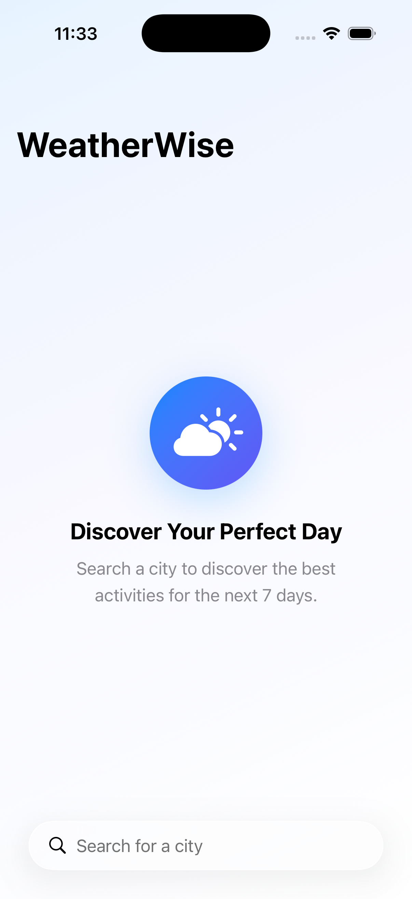
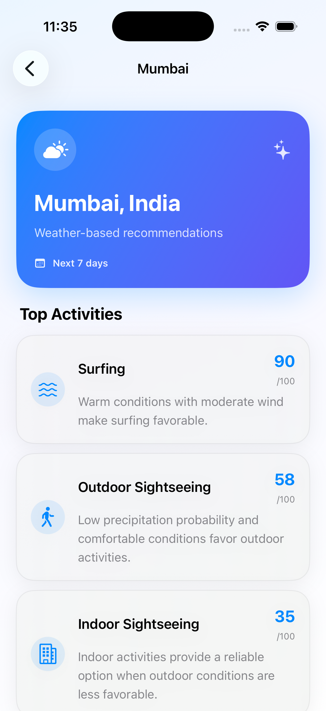
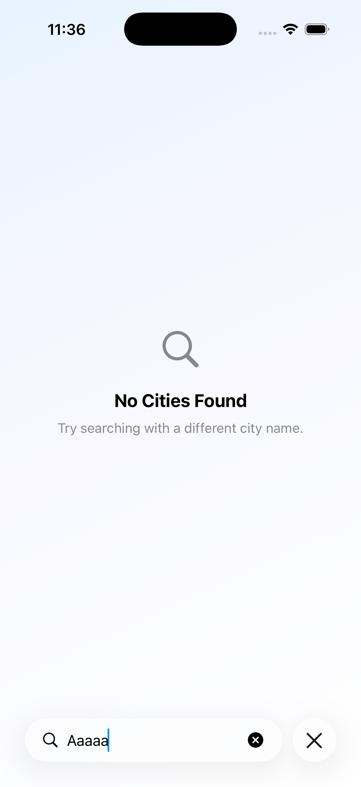

# WeatherWise

A native iOS application that recommends the best activities for a city based on its weather forecast for the next 7 days.

WeatherWise uses the Open-Meteo Geocoding API to search for cities and the Open-Meteo Forecast API to retrieve weather data and generate activity recommendations.

---

## Screenshots

### City Search

<p align="center">
  
</p>

Search for a city using the native SwiftUI search experience.

### City Results

<p align="center">
  
</p>

Select a city from the available search results.

### Activity Recommendations

<p align="center">
  
</p>

Activities are ranked based on weather conditions across the next 7 days.

### Error Handling

<p align="center">
  
</p>

Network and API failures are handled through explicit error states with retry support.

---

## Features

- Search cities using Open-Meteo Geocoding API
- 7-day weather forecast
- Weather-based activity recommendations
- Ranked activity results
- Skiing recommendations
- Surfing recommendations
- Outdoor sightseeing recommendations
- Indoor sightseeing recommendations
- Pull-to-refresh
- Offline forecast fallback
- Local forecast caching
- Explicit loading, empty, success, and error states
- Swift concurrency
- Protocol-based dependency injection
- Unit testing
- Native SwiftUI UI
- Dark mode support
- UI animations

---

## Tech Stack

| Technology | Usage |
|---|---|
| Swift | Application language |
| SwiftUI | User interface |
| Swift Concurrency | Asynchronous operations |
| Observation | ViewModel state observation |
| MVVM | Presentation architecture |
| Clean Architecture | Application architecture |
| URLSession | Networking |
| Open-Meteo | Geocoding and weather APIs |
| UserDefaults | Forecast caching |
| Swift Testing | Unit tests |
| Xcode | Development |

---

## Architecture

WeatherWise follows **Clean Architecture + MVVM**.

```text
Presentation
     ↓
Domain
     ↓
Data
     ↓
Core Networking
     ↓
Open-Meteo APIs
```

### Presentation Layer

Responsible for:

- SwiftUI views
- ViewModels
- UI state
- User interactions

### Domain Layer

Contains:

- Business models
- Use cases
- Repository protocols
- Recommendation logic

The domain layer does not depend on SwiftUI or networking implementations.

### Data Layer

Contains:

- API DTOs
- Repository implementations
- Forecast cache

The data layer converts API responses into domain models.

### Core Layer

Contains:

- API client
- API endpoints
- Network errors
- Application errors

---

## Project Structure

```text
WeatherWise/
│
├── App/
│   └── AppContainer.swift
│
├── Core/
│   ├── Errors/
│   │   ├── APIError.swift
│   │   └── AppError.swift
│   │
│   └── Networking/
│       ├── APIClient.swift
│       ├── APIEndpoint.swift
│       └── URLSessionAPIClient.swift
│
├── Data/
│   ├── DTOs/
│   │   ├── ForecastResponseDTO.swift
│   │   └── GeocodingResponseDTO.swift
│   │
│   └── Repositories/
│       ├── OpenMeteoLocationRepository.swift
│       ├── OpenMeteoWeatherRepository.swift
│       └── UserDefaultsWeatherCache.swift
│
├── Domain/
│   ├── Models/
│   │   ├── Activity.swift
│   │   ├── ActivityRecommendation.swift
│   │   ├── City.swift
│   │   ├── WeatherDay.swift
│   │   └── WeatherForecast.swift
│   │
│   ├── Repositories/
│   │   ├── LocationRepository.swift
│   │   ├── WeatherCache.swift
│   │   └── WeatherRepository.swift
│   │
│   └── UseCases/
│       ├── GetActivityRecommendationsUseCase.swift
│       └── SearchCitiesUseCase.swift
│
├── Presentation/
│   ├── Search/
│   │   ├── CitySearchState.swift
│   │   ├── CitySearchView.swift
│   │   └── CitySearchViewModel.swift
│   │
│   └── Recommendations/
│       ├── ActivityRecommendationRow.swift
│       ├── ActivityRecommendationsView.swift
│       ├── ActivityRecommendationsViewModel.swift
│       └── RecommendationState.swift
│
└── WeatherWiseApp.swift
```

---

## Data Flow

### City Search

```text
User
 ↓
CitySearchView
 ↓
CitySearchViewModel
 ↓
SearchCitiesUseCase
 ↓
LocationRepository
 ↓
OpenMeteoLocationRepository
 ↓
APIClient
 ↓
Open-Meteo Geocoding API
```

### Weather Recommendations

```text
Selected City
 ↓
ActivityRecommendationsView
 ↓
ActivityRecommendationsViewModel
 ↓
WeatherRepository
 ↓
OpenMeteoWeatherRepository
 ↓
APIClient
 ↓
Open-Meteo Forecast API
 ↓
WeatherForecast
 ↓
GetActivityRecommendationsUseCase
 ↓
Ranked Activities
```

---

## API Usage

WeatherWise uses the Open-Meteo APIs.

### Geocoding API

The Geocoding API is used to search for cities.

The application retrieves:

- City name
- Country
- Latitude
- Longitude
- Timezone

### Forecast API

The Forecast API is used to retrieve weather information for the next 7 days.

The application requests:

- Weather code
- Maximum temperature
- Minimum temperature
- Precipitation probability
- Precipitation amount
- Snowfall
- Maximum wind speed
- Sunshine duration
- UV index

No API key is required.

---

## Recommendation Logic

Each activity receives a score from **0 to 100**.

The score is calculated independently for each available forecast day and then averaged across the forecast period.

Activities are ranked by their average score in descending order.

### Skiing

The scoring considers:

- Snowfall
- Minimum temperature
- Maximum temperature
- Precipitation probability
- Wind speed

### Surfing

The scoring considers:

- Maximum temperature
- Wind speed
- Precipitation probability
- Sunshine duration

### Outdoor Sightseeing

The scoring considers:

- Temperature
- Precipitation probability
- Wind speed
- Sunshine duration
- UV index

### Indoor Sightseeing

The scoring considers:

- Precipitation probability
- Precipitation amount
- Extreme temperatures
- High wind speed

The recommendation algorithm is deterministic and implemented inside the domain layer.

---

## Weather Field Assumptions

| Open-Meteo Field | Usage |
|---|---|
| `temperature_2m_max` | Daytime temperature suitability |
| `temperature_2m_min` | Skiing suitability |
| `precipitation_probability_max` | Precipitation likelihood |
| `precipitation_sum` | Precipitation intensity |
| `snowfall_sum` | Skiing suitability |
| `wind_speed_10m_max` | Wind suitability |
| `sunshine_duration` | Outdoor and surfing suitability |
| `uv_index_max` | Outdoor sightseeing suitability |
| `weather_code` | Weather condition data |

These recommendations are heuristic and are not intended to replace professional weather or safety guidance.

---

## State Management

The application uses explicit state models.

### City Search

```text
idle
searching
loaded
empty
failed
```

### Recommendations

```text
idle
loading
loaded
failed
```

This keeps loading, success, empty, and error behavior explicit.

---

## Offline Support

Successfully retrieved forecasts are stored locally using `UserDefaults`.

When a weather request fails:

```text
Network Request
      │
      ├── Success
      │      ↓
      │   Save Cache
      │      ↓
      │   Return Forecast
      │
      └── Failure
             ↓
        Check Cache
          │       │
       Found    Missing
          │       │
          ↓       ↓
       Return   Return
       Cached    Error
       Forecast
```

The cache is keyed using the forecast coordinates.

---

## Error Handling

The networking layer uses typed errors for predictable error handling.

Supported errors include:

```text
invalidURL
networkUnavailable
httpStatus
decodingFailed
requestFailed
unknown
```

These errors are mapped into user-facing `AppError` values before reaching the UI.

---

## Dependency Injection

The application uses protocol-based dependency injection.

Examples:

```swift
protocol APIClient: Sendable
```

```swift
protocol LocationRepository: Sendable
```

```swift
protocol WeatherRepository: Sendable
```

```swift
protocol WeatherCache: Sendable
```

Application dependencies are assembled in:

```text
WeatherWise/App/AppContainer.swift
```

This allows implementations to be replaced with test doubles during testing.

---

## Testing

The project contains unit tests for the main layers.

### Domain Tests

- Activity recommendation ranking
- Activity scoring
- Empty forecast handling
- City search validation
- Query trimming
- Error propagation

### Data Tests

- DTO-to-domain mapping
- API error handling
- Invalid forecast data
- Mismatched response arrays
- Weather cache save/load
- Cached forecast fallback

### Presentation Tests

- Initial ViewModel state
- Successful city search
- Empty search results
- Search failure
- Search retry
- Recommendation loading
- Recommendation failure
- Coordinate forwarding

Run all tests:

```bash
xcodebuild \
-project WeatherWise.xcodeproj \
-scheme WeatherWise \
-destination 'platform=iOS Simulator,name=iPhone 17 Pro' \
test
```

---

## Build & Run

### Requirements

- macOS
- Xcode
- iOS Simulator or physical iOS device

### Steps

1. Clone the repository.
2. Open `WeatherWise.xcodeproj`.
3. Select the `WeatherWise` scheme.
4. Select an iOS Simulator or connected device.
5. Build and run.

No API key is required.

---

## Production Readiness

The project includes:

- Clean Architecture
- MVVM
- Protocol-based dependency injection
- Swift concurrency
- Typed error handling
- Repository abstraction
- Offline forecast fallback
- Pull-to-refresh
- Explicit UI state management
- Unit-testable business logic
- Mockable networking
- Dark mode support
- UI animations

Potential future improvements:

- Cache expiration
- More advanced persistence
- Network retry policies
- Structured logging
- Analytics
- Remote configuration for recommendation thresholds
- Snapshot testing
- Full UI test coverage

---

## Trade-offs

### UserDefaults Cache

`UserDefaults` is sufficient for the relatively small forecast payload required by this assignment.

For a larger production application, SwiftData, Core Data, or another persistence layer could be considered.

### Recommendation Algorithm

The recommendation system uses deterministic rules rather than machine learning.

This keeps the behavior:

- Predictable
- Explainable
- Testable
- Easy to modify

### No Backend

The application communicates directly with Open-Meteo because the assignment does not require a backend.

---

## Cross-Platform Considerations

The domain and data layers are independent of SwiftUI.

The architecture can therefore support additional Apple platforms while keeping the core business logic and repository implementations reusable.

Platform-specific UI can be introduced independently for iPadOS or macOS.

---

## AI Disclosure

AI-assisted development was used during implementation for:

- Code Improvement
- Debugging assistance
- Documentation
